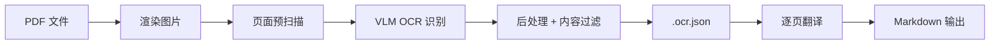
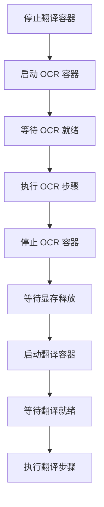
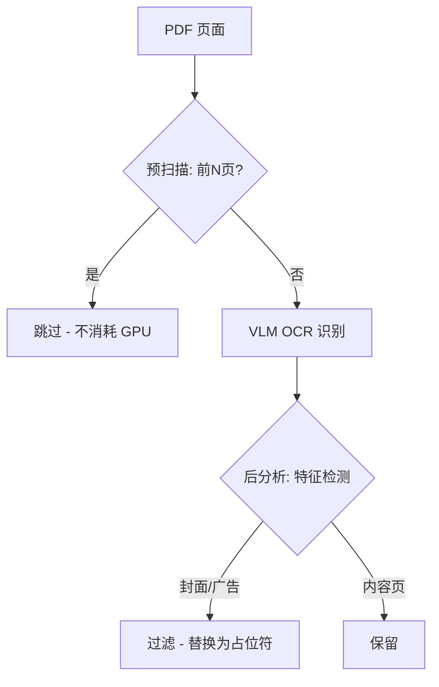
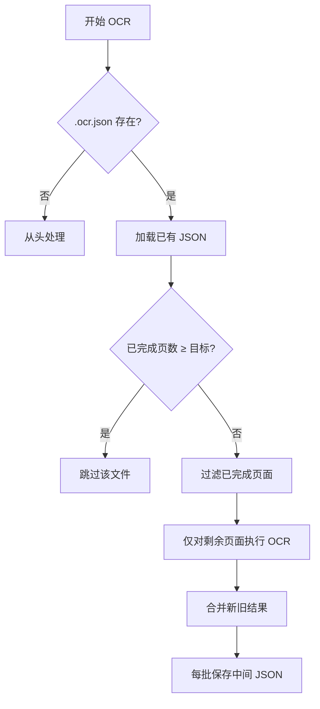
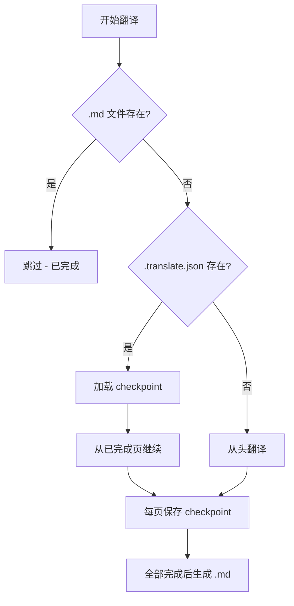

# PDF 转 Markdown 流水线

将扫描版 PDF（如《经济学人》杂志）通过 OCR 识别 + 翻译，转换为中文 Markdown 文件。

## 1. 项目概述

本项目实现了一个两阶段串行流水线，将扫描版 PDF 杂志转换为中文 Markdown：

- **阶段 1（OCR）**：PDF → 渲染图片 → VLM 结构化识别 → 后处理过滤 → 保存中间 JSON
- **阶段 2（翻译）**：读取 JSON → 逐页翻译 → 生成 Markdown

**为什么分两阶段？** GPU 显存仅 16GB（RTX 5060 Ti），OCR 模型（PaddleOCR-VL 0.9B）和翻译模型（sisyphus）无法同时运行。流水线通过串行切换 Docker 容器来复用同一块 GPU。

## 2. 项目架构

### 2.1 整体流程



### 2.2 容器编排

| 容器 | 镜像 | 端口 | 用途 | 管理方式 |
|------|------|------|------|---------|
| `paddleocr-genai` | PaddleOCR-VL vLLM Server | 8118 | OCR 结构化识别 | `docker compose up -d` |
| `sisyphus` | llama.cpp 翻译服务 | 8080 | 英译中翻译 | `docker start/stop`（外部项目） |

**串行切换流程**：



`run_pipeline.sh` 自动完成容器切换，也可手动分步执行。

### 2.3 核心模块

| 模块 | 职责 |
|------|------|
| `main.py` | 主流水线入口，分步模式（`--step ocr/translate`）和完整模式 |
| `ocr.py` | OCR 引擎抽象层，定义 `OCRElement` 数据结构和引擎接口 |
| `paddleocr_engine.py` | PaddleOCR-VL 引擎实现，调用 vLLM OpenAI Compatible API |
| `page_filter.py` | 页面过滤：预扫描跳过封面 + OCR 后分析检测封面/广告 |
| `postprocess.py` | 轻量后处理器（VLM 输出已足够干净，仅做基本过滤） |
| `translate.py` | 翻译器：批量翻译、逐条降级、编号解析、断点续翻 |
| `markdown.py` | Markdown 文档生成器 |
| `pdf2image.py` | PDF 渲染：页面提取、图片转换（基于 PyMuPDF） |
| `config.py` | 配置加载（YAML + 环境变量） |
| `notify.py` | 事件通知：流水线状态信号输出（供 IDE 监听） |
| `utils.py` | 工具函数：日志、进度条、文件名清理、目录管理 |

### 2.4 配置文件

| 文件 | 作用 |
|------|------|
| `config.yaml` | 主配置：OCR 引擎参数、页面过滤规则、翻译参数、路径设置 |
| `.env` | 敏感信息（API Key 等），不纳入版本控制 |

## 3. 页面过滤机制

采用两层过滤策略，兼顾效率与准确性：



### 3.1 预扫描阶段（OCR 前）

在 OCR 之前执行，**跳过前 N 页**（通过 `page_filter.skip_front_pages` 配置，默认 2）。

- **目的**：节省 GPU 调用（封面/内封不需要 OCR）
- **实现**：硬编码按页码索引跳过，不做内容分析
- **适用**：杂志前几页固定为封面/内封/广告的场景

### 3.2 OCR 后分析阶段（OCR 后）

每页 OCR 完成后，基于输出特征进行内容分析，作为兜底过滤。

#### 过滤规则

| # | 规则名称 | 判定条件 | 过滤原因 | config 参数 |
|---|---------|---------|---------|-------------|
| 1 | 封面检测 | 元素数 < `min_elements` **且** 文本重复率 ≥ `max_repeat_ratio` | 封面/扉页无正文内容（VLM 将封面标题拆分为多个相同文本块） | `min_elements: 4`<br>`max_repeat_ratio: 0.80` |
| 2 | 少元素广告 | 元素数 < `min_elements` **且** 总文本长度 < `max_text_len` | 整页广告（如品牌宣传页、产品广告） | `min_elements: 4`<br>`max_text_len: 2000` |
| 3 | 碎片化广告 | 元素数 ≥ `frag_ad_min_elements` **且** ≥ `frag_ad_short_ratio` 的元素文本长度 < `frag_ad_short_len` | 碎片化短文本广告（如活动推广页、课程宣传页） | `frag_ad_min_elements: 6`<br>`frag_ad_short_len: 100`<br>`frag_ad_short_ratio: 0.80` |
| 4 | 分类广告 | 联系方式模式（`Tel:`/`Email:`/`www.`/`http://`）出现 ≥ `classified_ad_min_contacts` 次 | 分类广告页（房产/招聘/法律免责声明等多个独立广告） | `classified_ad_min_contacts: 3` |
| 5 | 数据表格页 | 元素数 < `max_table_elements` **且** 总文本 ≥ `min_table_text_len` **且** 行重复率 ≥ `min_line_repeat_ratio` | 纯数据表格（表头被重复数百次，翻译无意义） | `max_table_elements: 5`<br>`min_table_text_len: 5000`<br>`min_line_repeat_ratio: 0.50` |

**规则执行顺序**：碎片化广告 → 分类广告 → 封面/少元素广告 → 表格页。规则 1-2 仅在元素数 < `min_elements` 时触发，规则 3-4 在元素数充足时提前检测特定广告类型。

#### 配置示例

所有阈值可在 `config.yaml` 的 `page_filter` 段调整：

```yaml
page_filter:
  # 预扫描
  skip_front_pages: 2              # 跳过前 N 页（封面/内封）
  
  # 规则 1 & 2：封面和少元素广告
  min_elements: 4                  # 元素数低于此值进入规则 1/2 检测
  max_repeat_ratio: 0.80           # 文本重复率阈值（封面）
  max_text_len: 2000               # 总文本长度阈值（广告）
  
  # 规则 3：碎片化广告
  frag_ad_min_elements: 6          # 最少元素数
  frag_ad_short_len: 100           # 短元素文字长度上限
  frag_ad_short_ratio: 0.80        # 短元素占比阈值
  
  # 规则 4：分类广告
  classified_ad_min_contacts: 3    # 联系方式模式最少出现次数
  
  # 规则 5：数据表格页
  max_table_elements: 5            # 表格页元素上限
  min_table_text_len: 5000         # 表格页文本下限
  min_line_repeat_ratio: 0.50      # 行重复率阈值
```

## 4. 断点续传机制

### 4.1 OCR 阶段断点续传



- **进度检测**：统计 JSON 中非 `null` 页面数量
- **增量处理**：仅对 `null` 页面执行 OCR，已处理页面保持不变
- **保存频率**：每 10 页（一个批次）保存一次中间 JSON
- **容错**：JSON 加载失败时自动从头开始

### 4.2 翻译阶段断点续传



- **三级检测**：先检查 `.md`（最终输出）→ 再检查 `.translate.json`（checkpoint）→ 从头开始
- **保存频率**：每翻译完 1 页立即保存 checkpoint
- **容错**：checkpoint 加载失败时从头开始

### 4.3 原子写入保护

所有关键文件写入均采用**临时文件 + 原子重命名**模式：

```python
# 写入临时文件
tmp_path = path.with_suffix(path.suffix + ".tmp")
with open(tmp_path, "w") as f:
    json.dump(data, f)
# 原子重命名（同一文件系统下不可中断）
os.replace(tmp_path, path)
```

**保护范围**：

| 文件 | 风险场景 | 保护效果 |
|------|---------|---------|
| `.ocr.json` | OCR 批次保存时被中断 | 旧文件完好，下次正常恢复 |
| `.translate.json` | 翻译 checkpoint 保存时被中断 | 旧 checkpoint 完好，继续恢复 |
| `.md` / `.txt` | 最终输出写入时被中断 | 旧文件不存在，不会被误判为已完成 |

### 4.4 脚本信号捕获

`run_pipeline.sh` 通过 `trap` 捕获中断信号，确保容器状态正确：

```bash
cleanup() {
    # 停止残留的 OCR 容器，释放 GPU 显存
    if docker ps | grep -q "^paddleocr-genai$"; then
        docker stop paddleocr-genai
    fi
}
trap cleanup EXIT INT TERM
```

捕获场景：Ctrl+C（INT）、`kill`（TERM）、脚本正常退出（EXIT）。

## 5. 使用方法

### 5.1 完整流水线（推荐）

```bash
# 处理 input/ 目录下所有 PDF
./run_pipeline.sh input/

# 处理单个 PDF
./run_pipeline.sh input/book.pdf

# 翻译输出纯文本（默认 Markdown）
./run_pipeline.sh input/ --text

# 跳过 OCR（已有 .ocr.json 时直接翻译）
./run_pipeline.sh input/ --skip-ocr
```

### 5.2 分步执行

手动控制两个阶段，适合调试或显存管理：

```bash
# 步骤 1：OCR（需要先启动 OCR 容器）
docker compose up -d                                    # 启动 OCR 容器
python -m src.main input/ --step ocr -o output/         # 执行 OCR
docker stop paddleocr-genai                             # 停止 OCR 容器

# 步骤 2：翻译（需要启动翻译容器）
docker start sisyphus                                   # 启动翻译容器
python -m src.main output/ --step translate -o output/  # 执行翻译
```

### 5.3 测试模式

使用 `--max-pages` 限制处理页数，快速验证流水线：

```bash
# 只处理前 10 页
python -m src.main input/ --step ocr -o output/ --max-pages 10

# 翻译（输出文件名自动包含页数范围）
python -m src.main output/ --step translate -o output/
# → translation/The_Economist_p1-10.md
```

**文件名约定**：当处理页数 ≠ PDF 总页数时，输出文件自动添加 `_p{start}-{end}` 后缀：

| 场景 | 输出文件名 |
|------|-----------|
| 完整处理（84页） | `The_Economist.md` |
| 部分处理（第1-10页） | `The_Economist_p1-10.md` |
| 部分处理（第3-20页） | `The_Economist_p3-20.md` |

### 5.4 目录结构

```
OCR/
├── input/              # 输入 PDF 文件
├── output/             # OCR 中间结果（.ocr.json）
├── translation/        # 最终翻译输出（.md / .txt）
├── logs/               # 日志文件
├── models/             # 本地模型（如有）
├── src/                # 源代码
│   ├── main.py         # 主流水线入口
│   ├── ocr.py          # OCR 引擎抽象层
│   ├── paddleocr_engine.py  # PaddleOCR-VL 引擎
│   ├── page_filter.py  # 页面过滤
│   ├── postprocess.py  # 后处理
│   ├── translate.py    # 翻译模块
│   ├── markdown.py     # Markdown 生成
│   ├── pdf2image.py    # PDF 渲染
│   ├── config.py       # 配置管理
│   ├── notify.py       # 事件通知
│   └── utils.py        # 工具函数
├── config.yaml         # 主配置文件
├── docker-compose.yml  # OCR 容器编排
├── run_pipeline.sh     # 流水线脚本（含容器切换）
└── requirements.txt    # Python 依赖
```

运行完整流水线
cd /mnt/e/OCR && ./run_pipeline.sh input/
rm -f /mnt/e/OCR/translation/* /mnt/e/OCR/output/*.translate.json
cd /mnt/e/OCR && ./run_pipeline.sh input/ --skip-ocr